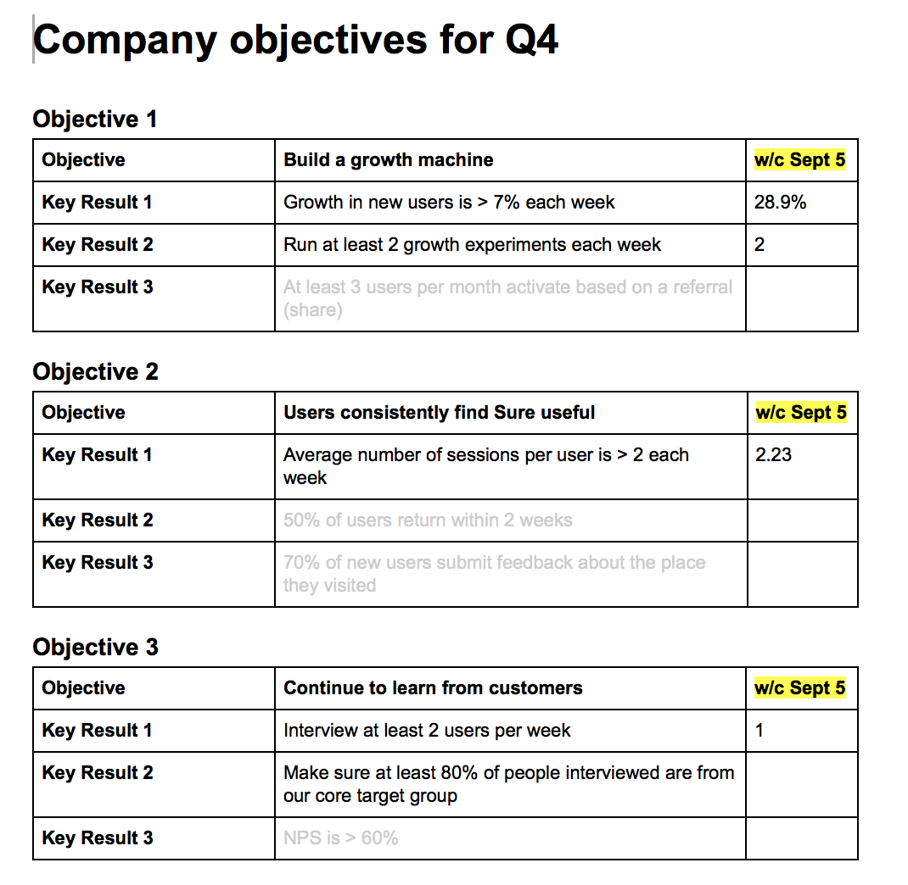

---
# Page settings
layout: default
keywords:
comments: false

# Hero section
title: OKRs - Objectives and Key Results
description: a goal-setting system that's been employed by the likes of Google, Intel and Bono to set and execute on audacious goals

# Author box
<!-- author:
    title: About Sebastian
    title_url: 'https://krumhausen.com'
    external_url: true
    description: Product Manager & Digital Strategist -->

# Micro navigation
micro_nav: true

# Page navigation

---

## What are objectives and key results?
Objectives and key results (usually known as ‘OKRs’) are used for setting simple, easily measurable goals within organisations and teams. OKRs are not only great for tracking the success of a project, but the process of setting them helps teams clarify what’s important, and why.

* **Objectives**: The “WHAT” you want to accomplish.
* **Key Results**: The “HOW” you’re going to get that done.

## Why OKRs?
OKRs provide a way of ensuring that the most important things are being worked on. They also serve as a way of looking back and evaluating successes and failures — useful for setting future goals, and seeing where teams might need extra help.

## OKR template
A simple two or three column template with Objectives and (key) Results

* **Objectives**: What do you want to accomplish?
* **Key Results**: How are you going to get that done?

*Example:*

## How to use OKRs

Here are a few keys to what make OKRs work at Google:

- Objectives are ambitious, and should feel somewhat uncomfortable

- Key Results are measurable; they should be easy to

  []:

   grade with a number (at Google we use a 0–1.0 scale to grade each key result at the end of a quarter)

- The “sweet spot” for an OKR grade is .6 — .7; if someone consistently gets 1.0, their OKRs aren’t ambitious enough. Low grades shouldn’t be punished; see them as data to help refine the next quarter’s OKRs.

- OKRs are public; everyone in the company should be able to see what everyone else is working on (and how they did in the past)

**Pro tip**: for details on how to run as well as some extra context, check [GV's guide to OKRs][gv-guide].

## Concluding notes
Don't think of OKRs as a proxy for performance reviews for individual employees. As [Rick states][gv-guide]:

> OKRs are not synonymous with employee evaluations. OKRs are about the company’s goals and how each employee contributes to those goals. Performance evaluations — which are entirely about evaluating how an employee performed in a given period — should be independent from their OKRs.

## Resources
- [https://weekdone.com/resources/objectives-key-results](https://weekdone.com/resources/objectives-key-results)
- [GV's guide to OKRs][gv-guide]
- [re:Work with Google](https://rework.withgoogle.com/guides/set-goals-with-okrs/steps/introduction/)
- [TED talk - Why the secret to success is setting the right goals - John Doerr](https://www.youtube.com/watch?v=L4N1q4RNi9I)

## Related plays

[gv-guide]: https://library.gv.com/how-google-sets-goals-okrs-a1f69b0b72c7#.tfwiuenot	"GV guide"
